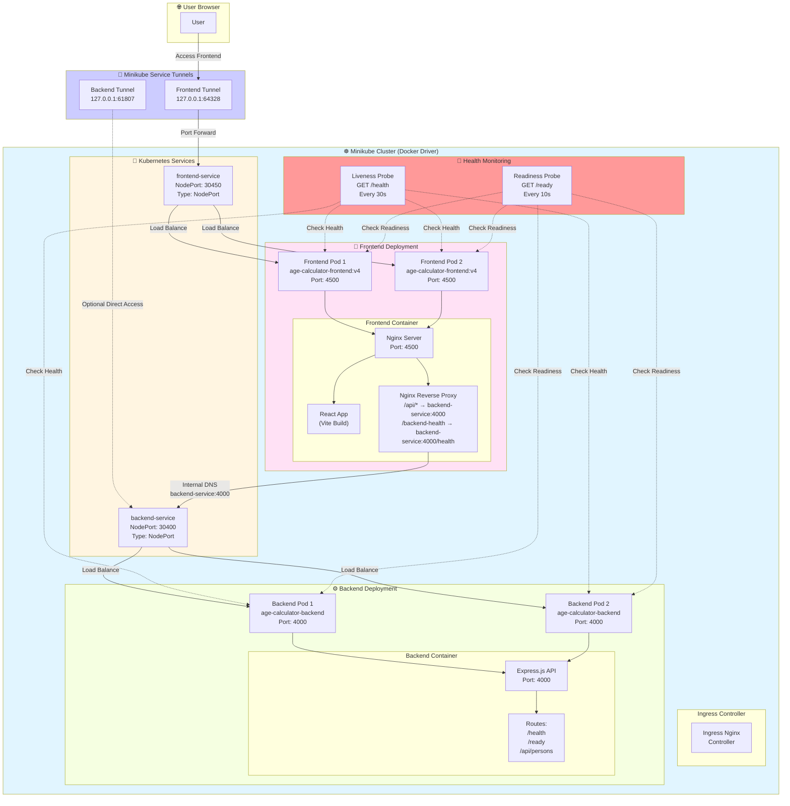
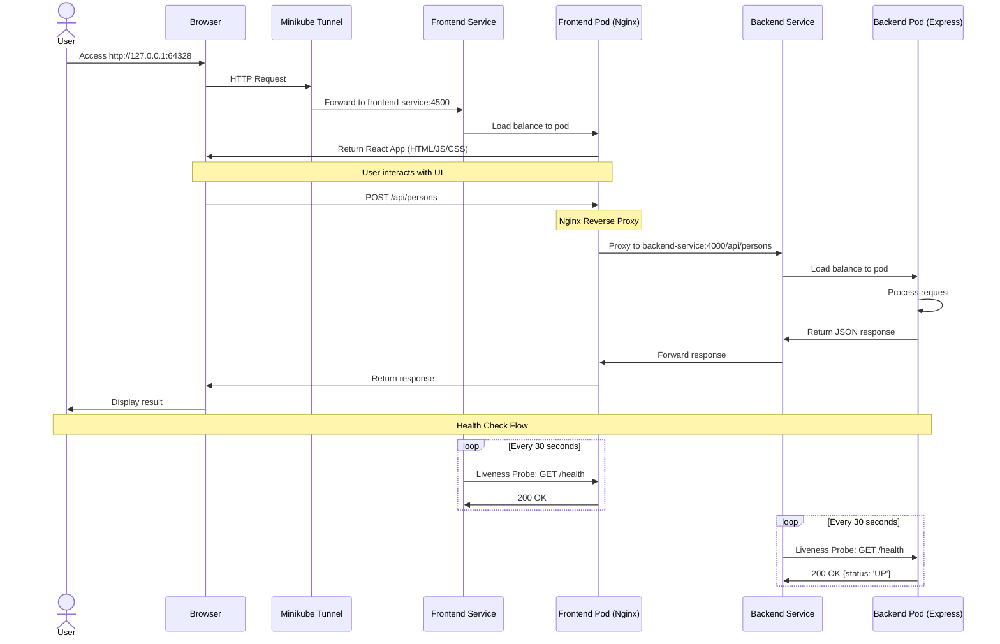

# Age Calculator Application - Kubernetes Cluster Architecture

## Cluster Flow Diagram



## Request Flow Diagram



## Component Details

### Frontend (React + Nginx)
- **Image**: `age-calculator-frontend:v4`
- **Replicas**: 2
- **Port**: 4500
- **Features**:
  - Nginx serves static React app
  - Reverse proxy for API calls
  - Health endpoint at `/health`
  - Liveness & Readiness probes configured

### Backend (Node.js + Express)
- **Image**: `age-calculator-backend:latest`
- **Replicas**: 2
- **Port**: 4000
- **Endpoints**:
  - `GET /health` - Health check (liveness)
  - `GET /ready` - Readiness check
  - `GET /api/persons` - List all persons
  - `POST /api/persons` - Add new person
  - `DELETE /api/persons/:id` - Delete person

### Services
- **frontend-service**: NodePort (30450) - Exposes frontend to outside cluster
- **backend-service**: NodePort (30400) - Exposes backend to outside cluster

### Health Probes
- **Liveness Probe**: Restarts container if fails
  - Initial delay: 10s
  - Period: 30s
  - Timeout: 5s

- **Readiness Probe**: Removes from service if fails
  - Initial delay: 5s
  - Period: 10s
  - Timeout: 3s

## Architecture Benefits

1. **High Availability**: 2 replicas of each service
2. **Load Balancing**: Kubernetes automatically distributes traffic
3. **Health Monitoring**: Automatic restart of unhealthy containers
4. **Service Discovery**: Internal DNS (backend-service:4000)
5. **Reverse Proxy**: Nginx handles CORS and routing
6. **Zero Downtime**: Rolling updates with readiness checks

## Network Flow Summary

```
User Browser
    ↓
Windows Minikube Tunnel (127.0.0.1:64328)
    ↓
Minikube Cluster (192.168.49.2)
    ↓
Frontend Service (NodePort 30450)
    ↓
Frontend Pods (Nginx + React)
    ↓ (via Nginx proxy)
Backend Service (ClusterIP → NodePort 30400)
    ↓
Backend Pods (Express API)
```
